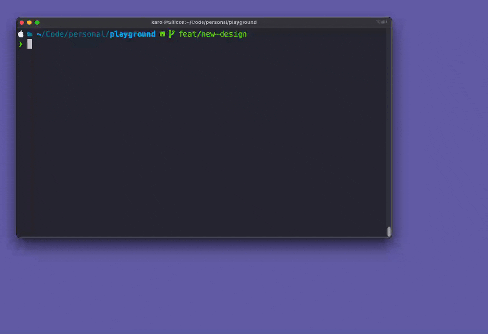

# `pro` - Pull Request Opener <!-- omit in toc -->

[](https://github.com/wowu/pro/releases/latest)
[](#installation)

A single command to open current PR in browser. Supports GitHub and GitLab. Available for macOS, Linux and Windows.


- [Demo](#demo)
- [Installation](#installation)
  - [Homebrew (macOS/Linux) - recommended](#homebrew-macoslinux---recommended)
  - [Scoop (Windows)](#scoop-windows)
  - [dpkg (Ubuntu/Debian)](#dpkg-ubuntudebian)
  - [Download latest binary (Linux)](#download-latest-binary-linux)
  - [Go package](#go-package)
  - [Compile from source](#compile-from-source)
  - [Precompiled binaries](#precompiled-binaries)
- [Usage](#usage)
  - [Authorize GitHub / GitLab](#authorize-github--gitlab)
    - [GitHub](#github)
    - [GitLab](#gitlab)
  - [Open Pull Request in default browser](#open-pull-request-in-default-browser)

## Demo



## Installation

### Homebrew (macOS/Linux) - recommended

```bash
brew install wowu/tap/pro
```

### Scoop (Windows)

```bash
scoop bucket add wowu https://github.com/wowu/scoop.git
scoop install wowu/pro
```

### dpkg (Ubuntu/Debian)

```bash
wget https://github.com/wowu/pro/releases/latest/download/pro-linux-amd64.deb
dpkg -i pro-linux-amd64.deb
```

Replace `amd64` with `arm64` if you are on ARM.

### Download latest binary (Linux)

```bash
curl -sSL -o /usr/local/bin/pro https://github.com/wowu/pro/releases/latest/download/pro-linux-amd64
chmod +x /usr/local/bin/pro
```

Replace `amd64` with `arm64` if you are on ARM.

### Go package

```bash
go install github.com/wowu/pro@latest
```

`pro` binary will be installed in `$GOPATH/bin` (most likely `~/go/bin/pro`).

### Compile from source

1. Install Go (`brew install go` or [see offical docs](https://go.dev/doc/install))
2. Clone the repository and build the project:

   ```bash
   git clone git@github.com:wowu/pro.git && cd pro
   go build
   ```

### Precompiled binaries

Download binaries from the [releases page](https://github.com/wowu/pro/releases/latest).

## Usage

### Authorize GitHub / GitLab

`pro` uses GitHub or GitLab API to find Pull Request related to current branch. Access is granted via personal access tokens.

#### GitHub

Use `auth` command to login:

```bash
pro auth github
```

You will be asked to [generate personal access token](https://github.com/settings/tokens/new?description=pro+cli&scopes=repo) and paste it in the prompt. It's recommended to change "Expiration" to "No expiration" before creating the token. Token will be stored in `~/.config/pro/config.yml`.

#### GitLab

Use `auth` command to login:

```bash
pro auth gitlab
```

You will be asked to [generate personal access token](https://gitlab.com/-/user_settings/personal_access_tokens?name=pro+cli&scopes=read_api) and paste it in the prompt. Token will be stored in `~/.config/pro/config.yml`.

### Open Pull Request in default browser

To open current Pull Request simply type:

```bash
pro
```

If you're on the main branch (`main`, `master`, `trunk`, etc.) repository homepage will be opened instead. If no PR matching current branch is found, a URL to create new Pull Request will be printed.

Use `-p | --print` flag to print the Pull Request URL instead of opening it in default browser:

```bash
pro -p
```

Use `-c | --copy` flag to copy the Pull Request URL to clipboard instead of opening it in default browser:

```bash
pro -c
```
