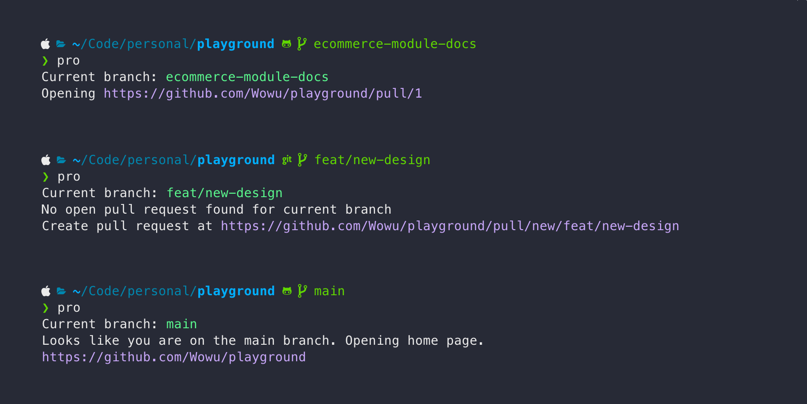

# `pro` - Pull Request Opener

A single command to open current PR in browser. Supports GitHub and GitLab.



## Usage

Open Pull Request for current branch in browser:

```bash
pro
```

Print Pull Request URL instead of opening it:

```bash
pro -p
```

Authorize `pro` to access your GitHub account:

```bash
pro auth github
```

Authorize `pro` to access your GitLab account:

```bash
pro auth gitlab
```

Tokens are stored in `~/.config/pro/config.yml` by default.

## Installation

### Homebrew (macOS/Linux)

```bash
brew install wowu/tap/pro
```

### Scoop (Windows)

```bash
scoop bucket add wowu https://github.com/wowu/scoop.git
scoop install wowu/pro
```

### dpkg (Ubuntu/Debian)

```bash
wget https://github.com/wowu/pro/releases/latest/download/pro-linux-amd64.deb
dpkg -i pro-linux-amd64.deb
```

Replace `amd64` with `arm64` if you are on ARM.

### Download binary (Linux)

```bash
curl -sSL -o /usr/local/bin/pro https://github.com/wowu/pro/releases/latest/download/pro-linux-amd64
chmod +x /usr/local/bin/pro
```

Replace `amd64` with `arm64` if you are on ARM.

### Go package

```bash
go install github.com/wowu/pro@latest
```

Go 1.18 is required. `pro` binary will be installed in `$GOPATH/bin` (most likely `~/go/bin/pro`).

### Compile from source

1. Install Go 1.18 (`brew install go` or [see offical docs](https://go.dev/doc/install))
2. Clone the repository and build the project:

    ```bash
    git clone git@github.com:Wowu/pro.git && cd pro
    go build
    ```

### Other platforms

Download binaries from the [releases page](https://github.com/wowu/pro/releases/latest).
